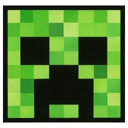
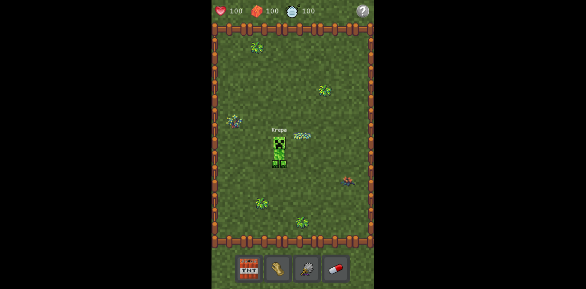

<h1 align="center">
    <br/>
    Krepagotchi
</h1>

<p align="center">
    Keep your Krepa as a pet<br/>
    (C) 2025 by Daniel Brendel
</p>

<p align="center">
    
    
    
    
</p>

<p align="center">
    
</p>

## Author

__Author__: Daniel Brendel\
__Contact__: dbrendel1988(at)gmail(dot)com\
__GitHub__: https://github.com/danielbrendel

## Description

Krepagotchi is a virtual pet game where you need to take care of your own little Krepa. You need to feed it, clean its home, and give medicine if it is sick.
You can also pet it, which is a lovely way to show affection.

## Disclaimer

This project is a fan-made game and is not affiliated with Mojang, Microsoft, Bandai, or any of their properties.

## Features
- Krepa pet
- Feeding
- Petting
- Cleaning
- Treatment
- Cute pixel art
- PWA support

## Run locally

In order to run the game locally during development process, issue one of the following commands.

Use Asatru CLI to run development server
```sh
php asatru serve
```

Use AquaShell to run development server
```sh
aquashell launch.dnys
```

## Make a shippable game build

Make a release build
```sh
php asatru game:release [platform]
```

Make a debug build
```sh
php asatru game:debug [platform]
```

`platform` can be one of the following:
- windows
- linux
- macos
- html5 (default)

The ready-packaged game builds are stored in the `/public/builds` directory
